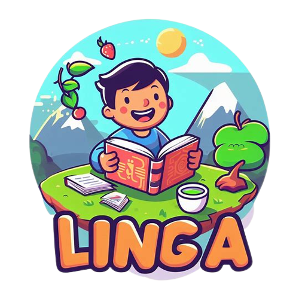
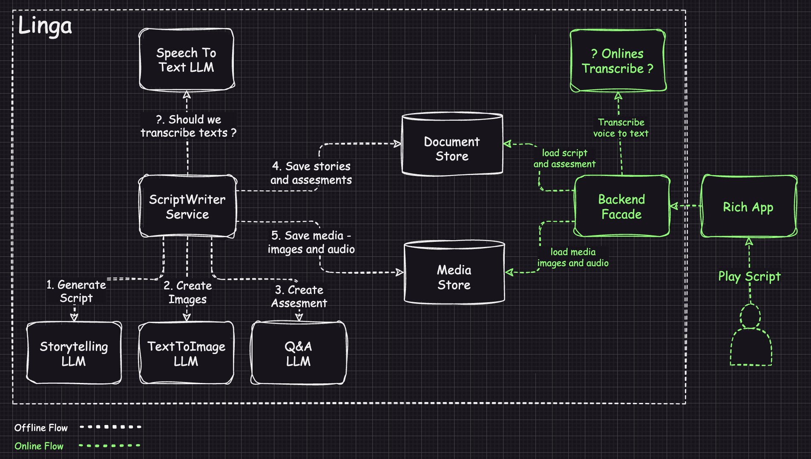

<h1 align="center"> Linga </h1> 
<h3>English Learning through Comic-based AI </h3>
<h4 align="center">
🚀 Exciting News! Introducing Linga, a SAAS platform revolutionizing English language learning through interactive comics. 📚🗣️ Powered by Generative AI, Linga tailors content to each student's proficiency and interests, aiding in pronunciation and vocabulary acquisition. Assessments track progress for a personalized learning journey. 🌟 #LanguageLearning #EdTechInnovation

🧠💡 Did you know? The Input Hypothesis by Stephen Krashen highlights the power of contextually relevant content just beyond one's proficiency level in language acquisition. Linga embraces this approach, making learning engaging and effective! 📖✨ #InnovativeEducation #LanguageAcquisition

🎨🖼️ Studies show that visual engagement aids in memory retention and contextual understanding of language. With Generative AI, Linga maximizes these benefits, paving the way for efficient language acquisition in children. 🧒🌐 #VisualLearning #FutureOfEducation #GenerativeAI
</h4>
 
 
 
<kbd>
 
</kbd>

# Linga - English Learning through Comic-based AI

## Summary
The proposed project aims to develop Linga, a Software as a Service (SAAS) platform that facilitates English language learning through interactive comics. Linga leverages Generative AI to create tailored comics based on students' proficiency level and interests. It provides assistance in pronunciation, vocabulary acquisition, and offers assessments to gauge learning progress. The platform will dynamically adjust text complexity, ensuring a gradual and effective learning experience.

## Background
Stephen Krashen's Input Hypothesis proposes that language acquisition occurs when learners are exposed to comprehensible input slightly beyond their current proficiency level, emphasizing the importance of meaningful and contextually relevant content. For instance, introducing children to a new language through materials aligned with their interests, while gradually increasing the language complexity, can be an engaging and effective approach.
Furthermore, studies suggest that incorporating graphic content is a valuable tool for language learning, as it visually engages learners, aids in memory retention, and provides context for understanding words and phrases. 
With the capabilities of Generative AI, the potential to develop Language Learning Services that facilitate efficient language acquisition for kids is within reach.

## Objectives
1. Customized Content Generation - Develop a Generative AI system to create comics aligned with students' English proficiency levels and individual interests.

2. Interactive Learning Features - Implement features enabling students to read aloud, receive assistance with unfamiliar words, and create personalized flashcards.

3. Progressive Text Complexity - Design algorithms that adapt text complexity, gradually challenging students slightly above their current proficiency level.

4. Assessment and Feedback - Create an assessment system to evaluate students' comprehension and retention of the material.
  
## Scope
The project encompasses the following key components:

1. Generative AI Development - Develop an AI model capable of generating comics based on user preferences, proficiency levels, and selected fields of interest.

2. User Interface and Experience - Design an intuitive interface for accessing, reading, and interacting with the comics.

3. Learning Assistance Features - Implement tools for pronunciation guidance, word lookup, and flashcard creation.

4. Adaptive Learning Algorithm - Design algorithms to adjust text complexity based on users' learning progress.

5. Assessment System - Create assessments to evaluate reading comprehension and retention.

<table width="256px">
  <tr>
    <td></td>
  </tr>
  <tr><td align="center">Linga</td></tr>
</table>  

## MVP
Linga MVP is an open source Python library that contains functionality for creating and assessing Comics 
and assessing customers understanding that read the comics. Here are milestones:
1. Create Comics
2. Create Assesment
3. Deploy as package to pip

## How To
[TBD](/README.mdREADME.md)

