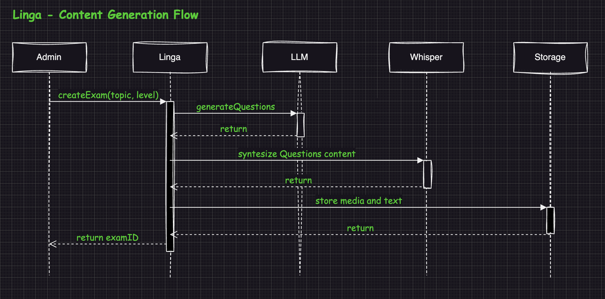

<h1 align="center"> Linga </h1> 
<h3>Language Education with ASR Technology </h3>
<h4 align="center">
Presenting Linga, a revolutionary SAAS that harnesses the power of <a href="https://en.wikipedia.org/wiki/Speech_recognition">ASR technology</a> for comprehensive <a href="https://en.wikipedia.org/wiki/Test_of_English_as_a_Foreign_Language">TOEFL</a>, [IELTS](https://ielts.org/), and [Cambridge C1 & C2](https://www.cambridgeenglish.org/exams-and-tests/advanced/) tests preparation. Elevate your language proficiency through dynamic conversations, receive instant feedback, and benefit from an adaptive curriculum tailored to your progress. With a user-friendly interface, Linga covers all facets of the English exams, allowing you to practice and improve your skills anytime, anywhere. Transform your language preparation with Linga for a personalized, efficient, and enjoyable journey to English proficiency.
</h4>
 
 
 
<kbd>
 
</kbd>

# Linga: Language Education with ASR Technology

## Summary
Linga, an innovative Software as a Service (SAAS), presents a transformative solution for TOEFL/IELTS/Cambridge C1&C2 tests preparation through cutting-edge [Automatic Speech Recognition](https://en.wikipedia.org/wiki/Speech_recognition)  technology. Linga automates language learning by providing instant feedback, personalized practice sessions, and an adaptive curriculum, streamlining the path to English proficiency. This platform revolutionizes English Tests preparation, offering a user-friendly interface and the convenience of anytime, anywhere learning. Linga is poised to redefine language education, making test readiness efficient, effective, and accessible for learners worldwide.

## Background
[Whisper](https://github.com/openai/whisper), is a general-purpose speech recognition model built by OpenAI, trained on 680,000 hours of diverse multilingual and multitask supervised data from the web. This extensive dataset enhances robustness to accents, background noise, and technical language. It facilitates transcription in multiple languages and translation into English. Linga leverages the robustness of Whisper offering an innovative and accessible approach to English learning and exam preparation.

## Objectives
Linga, our innovative Software as a Service (SAAS), utilizes cutting-edge Automatic Speech Recognition (ASR) technology to simulate the interview process for [TOEFL](https://en.wikipedia.org/wiki/Test_of_English_as_a_Foreign_Language), [IELTS](https://ielts.org/), and [Cambridge C1 & C2](https://www.cambridgeenglish.org/exams-and-tests/advanced/) tests. The objectives include enhancing exam readiness, personalizing learning pathways, providing real-time feedback, ensuring a user-friendly interface, and maintaining scalability through continuous technological innovation. Linga aims to revolutionize English language exam preparation by offering a dynamic, adaptive and cost effective solution for students worldwide.
  

## Scope
Linga essentially operates through two streams: a content generation flow and an exam simulator mode.
- Content Generation Flow
<table width="128px">
  <tr>
    <td></td>
  </tr>
  <tr><td align="center">Linga - Content Generation Flow</td></tr>
</table>  

- Exam Simulator Mode
[TBD]()

## MVP
[TBD]()

## How To
[TBD](/README.mdREADME.md)

